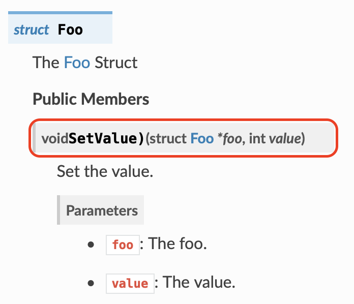

This repo illustrates an issue generating documentation for a function pointer
within a struct.

## The Issue

The input:

    /**
     * The Foo Struct
     */
    struct Foo {
        /**
         * Set the value.
         *
         * @param foo The foo.
         * @param value The value.
         */
        void (*SetValue)(struct Foo *foo, int value);
    };

Notice the missing parenthesis and star in this output:

## Using the example

The documentation can be built by executing `make docs`. This will generate HTML inside `docs/`.
